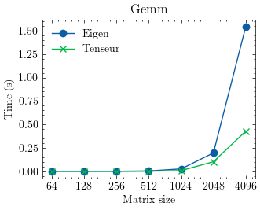
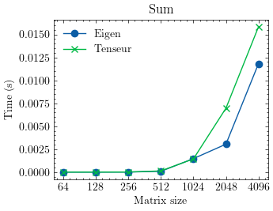
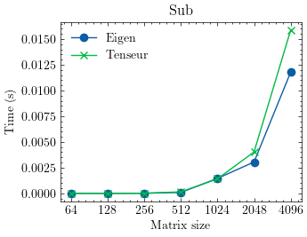
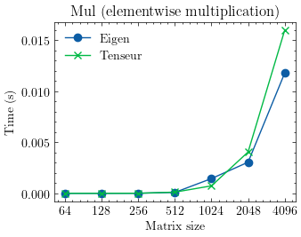

Benchmarks
==========

Benchmarks agains `Eigen <https://eigen.tuxfamily.org/index.php?title=Main_Page>`_ on a AMD Ryzen 5 processor:

- Generalized matrix multiplication 

- Elementwise addition

- Elementwise substraction

- Elementwise multiplication

- Elementwise division

