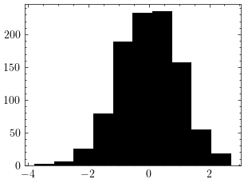

Getting started
===============

API
---
Tenseur has an easy to use api, It can be illustrated with the following example:

.. code-block:: cpp

   // Normal distribution
   ten::normal norm;
   // Sample from a normal distribution
   ten::vector<float> x = norm.sample(1000);
   // Save to a mtx file (Matrix Market format)
   ten::save_mtx(x, "norm.mtx");

The saved file can be loaded in numpy:

.. code-block:: python

   import numpy as np
   import scipy as sp
   import matplotlib.pyplot as plt
   import seaborn as sn
   plt.style.use("science")
   a = sp.io.mmread("norm.mtx").flatten()
   plt.hist(a, color = "black")
   plt.show()

Constructors
------------

The following constructors are defined for vectors, matrices, and tensors:

Vector
------

.. code-block:: cpp

   size_t size = 5;
   // Uninitialized vector
   ten::vector<T> x({size});
   // Vector initialized with data
   ten::vector<T> y({size}, {0., 1., 2., 3., 4.});

Static vector
-------------

.. code-block:: cpp

   constexpr size_t size = 5;
   ten::svector<float, size> x;
   ten::svector<float, size> y({0., 1., 2., 3., 4.});

Matrix
------

.. code-block:: cpp

   ten::matrix<float> x({2, 3});
   ten::matrix<float> y({2, 3}, {0., 1., 2., 3., 4., 5.});

Static matrix
-------------

.. code-block:: cpp

   ten::smatrix<float, 2, 3> x;
   ten::smatrix<float, 2, 3> y({0., 1., 2., 3., 4., 5.});

Tensor
------

.. code-block:: cpp

   ten::tensor<float> x({2, 3, 4});
   ten::tensor<float> y({2, 3}, {0., 1., 2., 3., 4., 5.});

Static tensor
-------------

.. code-block:: cpp

   ten::stensor<float, 2, 3, 4> x;
   ten::stensor<float, 2, 3> y({0., 1., 2., 3., 4., 5.});

Special matrices
----------------

- Transposed

.. code-block:: cpp

   ten::matrix<float> x = ten::range<ten::matrix<float>>({2, 3});
   auto y = ten::transposed(x);
   std::cout << std::boolalpha << y.is_transposed() << std::endl;

- Symmetric

.. code-block:: cpp

   ten::matrix<float> x({2, 2}, {1.0f, 0.0f, 0.0f, 1.0f});
   auto y = ten::symmetric(x);
   std::cout << std::boolalpha << y.is_symmetric() << std::endl;

- Hermitian

.. code-block:: cpp

   ten::matrix<std::complex<float>> x({2, 2}, {1.0f, 1.0f-1.0i, 1.0f + 1.0i, 2.0f});
   auto y = ten::hermitian(x);
   std::cout << std::boolalpha << y.is_hermitian() << std::endl;
   std::cout << y << std::endl;

- Lower triangular

.. code-block:: cpp

   ten::matrix<float> x({2, 2}, {1.0f, 2.0f, 0.0f, 3.0f});
   auto y = ten::lower_tr(x);
   std::cout << std::boolalpha << y.is_lower_tr() << std::endl;
   std::cout << y << std::endl;

- Upper triangular

.. code-block:: cpp

   ten::matrix<float> x({2, 2}, {1.0f, 0.0f, 2.0f, 3.0f});
   auto y = ten::upper_tr(x);
   std::cout << std::boolalpha << y.is_upper_tr() << std::endl;
   std::cout << y << std::endl;

